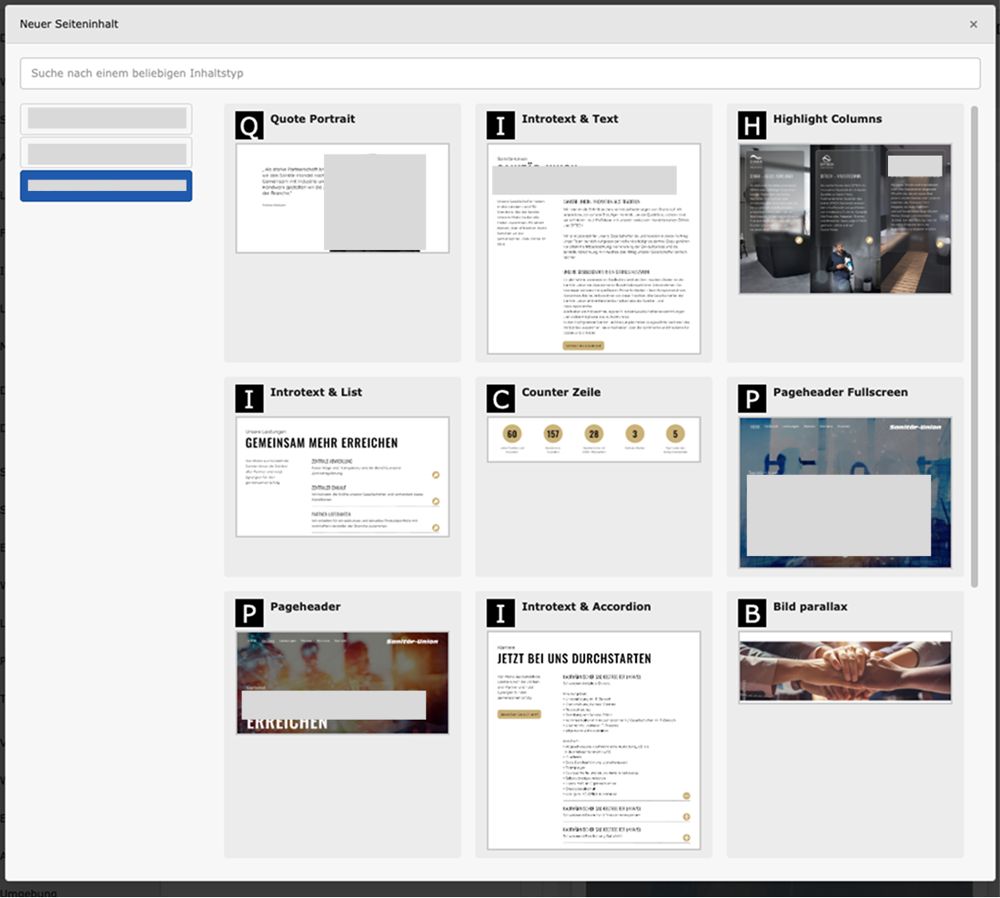
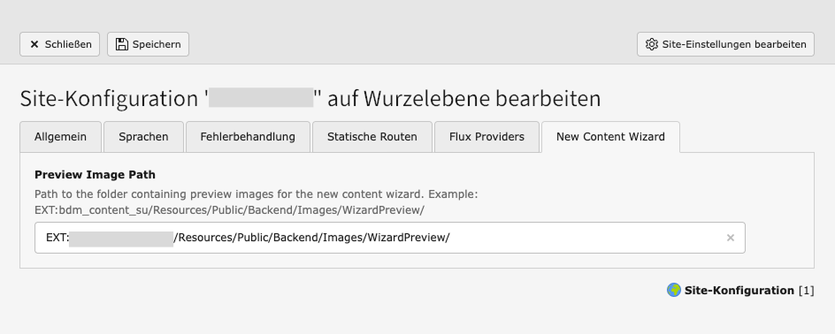

## TYPO3 Extension: Wizard-Preview

Extension that enhances the new content element wizard by displaying preview images. 

### Default TYPO3 Wizard
<kbd>
   
  
   
</kbd>


### Enhanced Wizard
<kbd>
   
  


   
</kbd>


### Compatibility
Tested with TYPO3 13.4

### Installation

1. Start by adding our repository to your composer.json:
   ```yaml
   "repositories": [
     {
       "url": "https://github.com/BenjaminBeck/bdm_wizard_preview.git",
       "type": "git"
     }
   ],
   ```
2. Install the extension using composer:
   ```sh
   composer req bdm/bdm_wizard_preview:^13.4
   ```

3. Configure the preview image folder in the Site Configuration.

   

4. Adding Preview Images<br>
   <br>
   Place the preview images in the specified folder. Ensure filenames correspond with the contents CType. In TYPO3 development context the wizard will guide you by displaying the required filename by clicking on the dev-icon. Additional variant images can be displayed by adding files ending with `-variant-` followed by a number. For example: If the de default preview image is `textmedia.png` the first variant image is `textmedia-variant-1.png`.<br>
    For plugins the filename is `{CType}_{listType}.png`.<br>
    <br>
   

